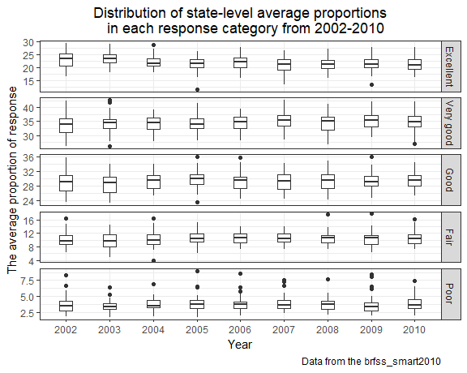
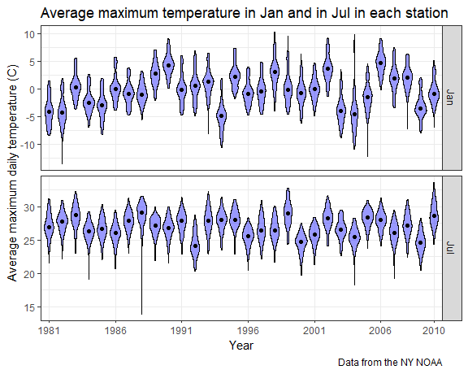

p8105\_hw3\_hq2163\_hanbo
================
Hanbo Qiu
October 7, 2018

Problem 1
---------

#### Create an overall\_health dataset and clean it

``` r
data(brfss_smart2010)

overall_health = janitor::clean_names(brfss_smart2010) %>% 
  select(year, location_abbr = locationabbr, location_desc = locationdesc, everything()) %>%
  filter(topic == "Overall Health") %>% 
  mutate(response = factor(response, levels = c("Excellent", "Very good", "Good", "Fair", "Poor"), ordered = TRUE))
```

We first load the data. Then we format the variables to use appropriate names, focus on the “Overall Health” topic, and organize responses as a factor taking levels ordered from “Excellent” to “Poor”.

#### Which states were observed at 7 locations in 2002?

``` r
#Make a table with distinct locations in 2002.
filter(overall_health, year == 2002) %>% 
  distinct(location_abbr, location_desc) %>% 
  count(location_abbr) %>% 
  filter(n == 7) %>% 
  knitr::kable(col.names = c("State", "No. of locations"))
```

| State |  No. of locations|
|:------|-----------------:|
| CT    |                 7|
| FL    |                 7|
| NC    |                 7|

The first column shows the states observed at 7 locations in 2002.

#### Make a “spaghetti plot” that shows the number of observations in each state from 2002 to 2010.

``` r
distinct(overall_health, year, location_abbr, location_desc) %>% 
  ggplot(aes(x = year, color = location_abbr)) +
  geom_freqpoly(binwidth = 1) +
  scale_x_continuous(breaks = 2002:2010, limits = c(2002,2010)) +
  labs(
    title = "The number of locations in each state from 2002 to 2010",
    x = "Year",
    y = "No. of locations",
    caption = "Data from the brfss_smart2010"
  ) +
  theme(legend.position = "none")
```

    ## Warning: Removed 102 rows containing missing values (geom_path).


The number of observations in State jumps to above 40 in 2007 and 2010. The number of observations all the other states kept under 20 for the rest of the years.

#### Showing the mean and standard deviation of the proportion of “Excellent” responses across locations in NY State in 2002, 2006, and 2010.

``` r
overall_health %>% 
  filter(year %in% c(2002, 2006, 2010), 
         response == "Excellent", 
         location_abbr == "NY") %>% 
  group_by(year) %>% 
  summarise(mean = mean(data_value, na.rm = TRUE),
            sd = sd(data_value, na.rm = TRUE)) %>% 
  knitr::kable(col.names = c("Year", "Mean of excellent proportion(%)", "SD of excellent proportion(%)"),
               digits = 2)
```

|  Year|  Mean of excellent proportion(%)|  SD of excellent proportion(%)|
|-----:|--------------------------------:|------------------------------:|
|  2002|                            24.04|                           4.49|
|  2006|                            22.53|                           4.00|
|  2010|                            22.70|                           3.57|

#### For each year and state, compute the average proportion and make a five-panel plot.

``` r
select(overall_health, year, location_abbr, response, data_value) %>% 
  group_by(response, year, location_abbr) %>% 
  summarise(mean = mean(data_value, na.rm = TRUE)) %>% 
  ungroup %>% 
  mutate(year = as.factor(year)) %>% 
  ggplot(aes(x = year, y = mean)) +
  geom_dotplot(binaxis="y", stackdir = "center", stackratio = 2) +
  facet_grid(response ~., scales = "free_y") +
  labs(
    title = "Response distribution of state-level averages from 2002-2010",
    x = "Year",
    y = "The average proportion of response",
    caption = "Data from the brfss_smart2010"
  )
```

    ## `stat_bindot()` using `bins = 30`. Pick better value with `binwidth`.



Problem 2
---------

#### Load the data from the p8105.datasets package:

``` r
data(instacart)
```

#### Write a short description of the dataset:

Instacart is an online grocery service that allows you to shop online from local stores. The dataset contains 1384617 observations and 15 variables of 131209 users. Each row in the dataset shows the information of a specific product in one order. Some key variables are user\_id and order\_id, by which we can identify each user and order. Product\_id/product\_name, aisle\_id/aisle, department\_id/department are key variables for product. The most important variables are reordered, order\_number, order\_dow, order\_hour\_of\_day, days\_since\_prior\_order, they can help us understand the customers' purchasing and consumption behaviour.

#### How many aisles are there, and which aisles are the most items ordered from?

There are 134 aisles.

``` r
item_aisle = count(instacart, aisle_id, sort = T)
```

No. 83 is the most items ordered aisle.

#### Make a plot that shows the number of items ordered in each aisle.

#### Make a table showing the most popular item aisles “baking ingredients”, “dog food care”, and “packaged vegetables fruits”.

``` r
filter(instacart, aisle %in% c("baking ingredients", "dog food care", "packaged vegetables fruits")) %>%
  group_by(aisle, product_name) %>% 
  summarise(n = n()) %>% 
  filter(min_rank(desc(n)) == 1) %>% 
  select(aisle, product_name) %>% 
  arrange(aisle) %>% 
  knitr::kable(col.names = c("Aisle", "Most popular product"))
```

| Aisle                      | Most popular product                          |
|:---------------------------|:----------------------------------------------|
| baking ingredients         | Light Brown Sugar                             |
| dog food care              | Snack Sticks Chicken & Rice Recipe Dog Treats |
| packaged vegetables fruits | Organic Baby Spinach                          |

#### Make a table showing the mean hour of the day at which Pink Lady Apples and Coffee Ice Cream are ordered on each day of the week.

``` r
filter(instacart, product_name %in% c("Pink Lady Apples", "Coffee Ice Cream")) %>% 
  group_by(product_name, order_dow) %>% 
  summarise(mean = round(mean(order_hour_of_day), 0)) %>% 
  mutate(mean = as.character(mean),
         mean = paste(mean, ":00", sep = "")) %>% 
  spread(key = order_dow, value = mean ) %>% 
  knitr::kable(caption = "The mean hour of the day",
               col.names = c("Product", "Sun", "Mon", "Tue", "Wed", "Thu", "Fri", "Sat"))
```

| Product          | Sun   | Mon   | Tue   | Wed   | Thu   | Fri   | Sat   |
|:-----------------|:------|:------|:------|:------|:------|:------|:------|
| Coffee Ice Cream | 14:00 | 14:00 | 15:00 | 15:00 | 15:00 | 12:00 | 14:00 |
| Pink Lady Apples | 13:00 | 11:00 | 12:00 | 14:00 | 12:00 | 13:00 | 12:00 |

The above table shows the mean hour of the day at which Pink Lady Apples and Coffee Ice Cream are ordered on each day of the week. As the data does not specify the meaning of values in order\_dow variable, I presume that the values of 0~6 represent Sunday to Saturday.

Problem 3
---------

``` r
# load the data from the p8105.datasets package and summarize the data
data(ny_noaa)

summary(ny_noaa)
```

    ##       id                 date                 prcp         
    ##  Length:2595176     Min.   :1981-01-01   Min.   :    0.00  
    ##  Class :character   1st Qu.:1988-11-29   1st Qu.:    0.00  
    ##  Mode  :character   Median :1997-01-21   Median :    0.00  
    ##                     Mean   :1997-01-01   Mean   :   29.82  
    ##                     3rd Qu.:2005-09-01   3rd Qu.:   23.00  
    ##                     Max.   :2010-12-31   Max.   :22860.00  
    ##                                          NA's   :145838    
    ##       snow             snwd            tmax               tmin          
    ##  Min.   :  -13    Min.   :   0.0   Length:2595176     Length:2595176    
    ##  1st Qu.:    0    1st Qu.:   0.0   Class :character   Class :character  
    ##  Median :    0    Median :   0.0   Mode  :character   Mode  :character  
    ##  Mean   :    5    Mean   :  37.3                                        
    ##  3rd Qu.:    0    3rd Qu.:   0.0                                        
    ##  Max.   :10160    Max.   :9195.0                                        
    ##  NA's   :381221   NA's   :591786

A short description of the dataset: ny\_noaa provides some weather data in NY city, including the GHCN -Daily database of summary statistics from weather stations. The dataset contains 2595176 observations and 7 variables, where each row in the dataset is daily record of weather during 1981-2010. Key variables includes 1."date" is Date of observation 2."prcp" which represents Precipitation (tenths of mm) recorded by the weather station on a specific day 3."snow" which represents Snowfall (mm) recorded by the weather station on a specific day 4."snwd": which represents Snow depth (mm) recorded by the weather station on a specific day 5."tmax" which represents the maximum temperature (tenths of degrees C) recorded by the weather station on a specific day 6."tmin" which represents the Minimum temperature (tenths of degrees C) recorded by the weather station on a specific day. There are missing data in variables: "prcp"(145838 NA), "snow"(381221 NA), "snwd"(591786 NA) and ."tmax","tmin". Each weather station collect only a subset of these variables, and therefore the resulting dataset contains extensive missing data which might influence the result.

Do some data cleaning and create separate variables for year, month, and day.

Convert observations for temperature, precipitation, and snowfall.

``` r
ny_noaa_ymd = separate(ny_noaa, date, into = c("year", "month", "day"), sep = "-") %>% 
    mutate(prcp = prcp / 10, tmin = as.numeric(tmin) / 10, tmax = as.numeric(tmax) / 10)
```

For snowfall, what are the most commonly observed values? Why?

``` r
snowfall_daycount = count(ny_noaa, snow, sort = T)
snowfall_daycount[1,1]
```

    ## # A tibble: 1 x 1
    ##    snow
    ##   <int>
    ## 1     0

Make a two-panel plot showing the average temperature in January and in July in each station across years. Is there any observable / interpretable structure? Any outliers?

``` r
temp_jan_jul = filter(ny_noaa_ymd, month %in% c("01","07")) %>% 
  group_by(id, year, month) %>% 
  summarise(mean_tmax = mean(tmax, na.rm = T)) %>%
  ungroup() %>% 
  mutate(month = recode(month, "01" = "Jan", "07" = "Jul"))

ggplot(temp_jan_jul, aes(x = year, y = mean_tmax,fill = year)) +
  geom_violin(color = "blue", alpha = 0.5) +
  stat_summary(fun.y = median, geom = "point", color = "blue", size = 1) +
  facet_grid(month ~., scales = "free_y") +
  theme(legend.position = "none")
```

    ## Warning: Removed 5970 rows containing non-finite values (stat_ydensity).

    ## Warning: Removed 5970 rows containing non-finite values (stat_summary).


