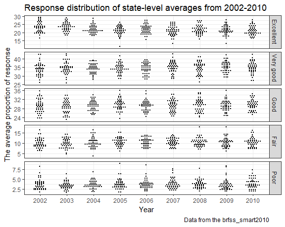

p8105\_hw3\_hq2163\_hanbo
================
Hanbo Qiu
October 7, 2018

Problem 1
---------

**Create an `overall_health` dataset and clean it:**

``` r
data(brfss_smart2010)

overall_health = janitor::clean_names(brfss_smart2010) %>% 
  select(year, location_abbr = locationabbr, location_desc = locationdesc, everything()) %>%
  filter(topic == "Overall Health") %>% 
  mutate(response = factor(response, levels = c("Excellent", "Very good", "Good", "Fair", "Poor"), ordered = TRUE))
```

We first load the data. Then we format the variables to use appropriate names, focus on the “Overall Health” topic, and organize responses as a factor taking levels ordered from “Excellent” to “Poor”.

**Which states were observed at 7 locations in 2002?**

``` r
filter(overall_health, year == 2002) %>% 
  distinct(location_abbr, location_desc) %>% 
  count(location_abbr) %>% 
  filter(n == 7) %>% 
  knitr::kable(col.names = c("State", "No. of locations"))
```

| State |  No. of locations|
|:------|-----------------:|
| CT    |                 7|
| FL    |                 7|
| NC    |                 7|

The first column shows the states observed at 7 locations in 2002.

**Make a “spaghetti plot” that shows the number of observations in each state from 2002 to 2010:**

``` r
distinct(overall_health, year, location_abbr, location_desc) %>% 
  ggplot(aes(x = year, color = location_abbr)) +
  geom_freqpoly(binwidth = 1) +
  scale_x_continuous(breaks = 2002:2010, limits = c(2002,2010)) +
  labs(
    title = "The number of locations in each state from 2002 to 2010",
    x = "Year",
    y = "Number of locations",
    caption = "Data from the brfss_smart2010"
  ) +
  theme(legend.position = "none")
```

    ## Warning: Removed 102 rows containing missing values (geom_path).


The number of observations in State jumps to above 40 in 2007 and 2010. The number of observations all the other states kept under 20 for the rest of the years.

**Showing the mean and standard deviation of the proportion of “Excellent” responses across locations in NY State in 2002, 2006, and 2010:**

``` r
overall_health %>% 
  filter(year %in% c(2002, 2006, 2010), 
         response == "Excellent", 
         location_abbr == "NY") %>% 
  group_by(year) %>% 
  summarise(mean = mean(data_value, na.rm = TRUE),
            sd = sd(data_value, na.rm = TRUE)) %>% 
  knitr::kable(col.names = c("Year", "Mean of excellent proportion(%)", "SD of excellent proportion(%)"),
               digits = 2)
```

|  Year|  Mean of excellent proportion(%)|  SD of excellent proportion(%)|
|-----:|--------------------------------:|------------------------------:|
|  2002|                            24.04|                           4.49|
|  2006|                            22.53|                           4.00|
|  2010|                            22.70|                           3.57|

**For each year and state, compute the average proportion and make a five-panel plot:**

``` r
select(overall_health, year, location_abbr, response, data_value) %>% 
  group_by(response, year, location_abbr) %>% 
  summarise(mean = mean(data_value, na.rm = TRUE)) %>% 
  ungroup %>% 
  mutate(year = as.factor(year)) %>% 
  ggplot(aes(x = year, y = mean)) +
  geom_dotplot(binaxis="y", stackdir = "center", stackratio = 2) +
  facet_grid(response ~., scales = "free_y") +
  labs(
    title = "Response distribution of state-level averages from 2002-2010",
    x = "Year",
    y = "The average proportion of response",
    caption = "Data from the brfss_smart2010"
  )
```

    ## `stat_bindot()` using `bins = 30`. Pick better value with `binwidth`.


Problem 1
---------

**Create an `overall_health` dataset and clean it:**

``` r
data(brfss_smart2010)

overall_health = janitor::clean_names(brfss_smart2010) %>% 
  select(year, location_abbr = locationabbr, location_desc = locationdesc, everything()) %>%
  filter(topic == "Overall Health") %>% 
  mutate(response = factor(response, levels = c("Excellent", "Very good", "Good", "Fair", "Poor"), ordered = TRUE))
```

We first load the data. Then we format the variables to use appropriate names, focus on the “Overall Health” topic, and organize responses as a factor taking levels ordered from “Excellent” to “Poor”.

**Which states were observed at 7 locations in 2002?**

``` r
filter(overall_health, year == 2002) %>% 
  distinct(location_abbr, location_desc) %>% 
  count(location_abbr) %>% 
  filter(n == 7) %>% 
  knitr::kable(col.names = c("State", "No. of locations"))
```

| State |  No. of locations|
|:------|-----------------:|
| CT    |                 7|
| FL    |                 7|
| NC    |                 7|

The first column shows the states observed at 7 locations in 2002.

**Make a “spaghetti plot” that shows the number of observations in each state from 2002 to 2010:**

``` r
distinct(overall_health, year, location_abbr, location_desc) %>% 
  ggplot(aes(x = year, color = location_abbr)) +
  geom_freqpoly(binwidth = 1) +
  scale_x_continuous(breaks = 2002:2010, limits = c(2002,2010)) +
  labs(
    title = "The number of locations in each state from 2002 to 2010",
    x = "Year",
    y = "Number of locations",
    caption = "Data from the brfss_smart2010"
  ) +
  theme(legend.position = "none")
```

    ## Warning: Removed 102 rows containing missing values (geom_path).


The number of observations in State jumps to above 40 in 2007 and 2010. The number of observations all the other states kept under 20 for the rest of the years.

**Showing the mean and standard deviation of the proportion of “Excellent” responses across locations in NY State in 2002, 2006, and 2010:**

``` r
overall_health %>% 
  filter(year %in% c(2002, 2006, 2010), 
         response == "Excellent", 
         location_abbr == "NY") %>% 
  group_by(year) %>% 
  summarise(mean = mean(data_value, na.rm = TRUE),
            sd = sd(data_value, na.rm = TRUE)) %>% 
  knitr::kable(col.names = c("Year", "Mean of excellent proportion(%)", "SD of excellent proportion(%)"),
               digits = 2)
```

|  Year|  Mean of excellent proportion(%)|  SD of excellent proportion(%)|
|-----:|--------------------------------:|------------------------------:|
|  2002|                            24.04|                           4.49|
|  2006|                            22.53|                           4.00|
|  2010|                            22.70|                           3.57|

**For each year and state, compute the average proportion and make a five-panel plot:**

``` r
select(overall_health, year, location_abbr, response, data_value) %>% 
  group_by(response, year, location_abbr) %>% 
  summarise(mean = mean(data_value, na.rm = TRUE)) %>% 
  ungroup %>% 
  mutate(year = as.factor(year)) %>% 
  ggplot(aes(x = year, y = mean)) +
  geom_dotplot(binaxis="y", stackdir = "center", stackratio = 2) +
  facet_grid(response ~., scales = "free_y") +
  labs(
    title = "Response distribution of state-level averages from 2002-2010",
    x = "Year",
    y = "The average proportion of response",
    caption = "Data from the brfss_smart2010"
  )
```

    ## `stat_bindot()` using `bins = 30`. Pick better value with `binwidth`.



Problem 3
---------

**Load the data**

``` r
data(ny_noaa)
```

**Write a short description of the dataset:**

The ny\_noaa data provides weather records in NY state during 1981-2010. It contains 2595176 observations and 7 variables, where each row records the weather records of a certain day observed in a certain sation. The key variables include `prcp`, `snow`, `snwd`, `tmax`, and `tmin`, which represent precipitation, snowfall, snow depth, maximum temperature, and minimun temperature, respectively. `prcp`, `snow` and `snwd` are all `integer` class variables, while `tmax` and `tmin` are `character` variables.

The proportion of missing values in some variables are 0.056 for `prcp`, 0.15 for `snow`, 0.23 for `snwd`, 0.44 for `tmax`, and 0.44 for `tmin`. Each weather station collect only a subset of these variables, and therefore the resulting dataset contains extensive missing data which might influence the result.

**Do some data cleaning:**

``` r
ny_noaa_ymd = separate(ny_noaa, date, into = c("year", "month", "day"), sep = "-") %>% 
    mutate(prcp = prcp / 10, tmin = as.numeric(tmin) / 10, tmax = as.numeric(tmax) / 10)
```

We separate `date` to three variables (`year`, `month`, `day`), and convert observations for `prcp`, `tmax` and `tmin` to reasonable units.

**For snowfall, what are the most commonly observed values? Why?**

``` r
snowfall_daycount = count(ny_noaa, snow, sort = T)
head(snowfall_daycount, 3)
```

    ## # A tibble: 3 x 2
    ##    snow       n
    ##   <int>   <int>
    ## 1     0 2008508
    ## 2    NA  381221
    ## 3    25   31022

From the above table, we find the most observed values for snowfall is 0 mm. The reason is that there is no snow fall in most days in NY.

**Make a two-panel plot showing the average max temperature in January and in July in each station across years:**

``` r
filter(ny_noaa_ymd, month %in% c("01","07")) %>%
  mutate(month = recode(month, "01" = "Jan", "07" = "Jul")) %>% 
  group_by(id, year, month) %>% 
  summarise(mean_tmax = mean(tmax, na.rm = T)) %>%
  ggplot(aes(x = year, y = mean_tmax)) +
  geom_violin(color = "black", fill = "blue", alpha = 0.4) +
  stat_summary(fun.y = median, geom = "point", color = "black", size = 1.5) +
  scale_x_discrete(breaks = c("1981", "1986", "1991", "1996", "2001", "2006", "2010")) +
  facet_grid(month ~., scales = "free_y") +
  labs(
    title = "Average maximum temperature in Jan and in Jul in each station",
    x = "Year",
    y = "Average maximum daily temperature (C)",
    caption = "Data from the NY NOAA"
  )
```

    ## Warning: Removed 5970 rows containing non-finite values (stat_ydensity).

    ## Warning: Removed 5970 rows containing non-finite values (stat_summary).


**Make a two-panel plot (i) `tmax` vs `tmin` for the full dataset; and (ii) make a plot showing the distribution of snowfall values greater than 0 and less than 100 separately by year:**

``` r
tmax_tmin = ggplot(ny_noaa_ymd, aes(x = tmin, y = tmax)) + 
  geom_hex(bins = 40) +
  labs(
    title = "Maximum temperature vs minimum temperature",
    x = "Minimum temperature (C)",
    y = "Maximum temperature (C)"
  ) +
  coord_fixed() +
  theme(legend.position = "right")

snow_fall = filter(ny_noaa_ymd, snow > 0, snow <100) %>% 
  ggplot(aes(x = year, y = snow)) +
  geom_boxplot() +
  scale_x_discrete(breaks = c("1981", "1986", "1991", "1996", "2001", "2006", "2010")) +
  labs(
    title = "The distribution of snowfall in each year",
    x = "Year",
    y = "Snow fall (mm)",
    caption = "Data from the NY NOAA"
  )  

tmax_tmin + snow_fall + plot_layout(ncol = 1, heights = c(3, 1))
```

    ## Warning: Removed 1136276 rows containing non-finite values (stat_binhex).


