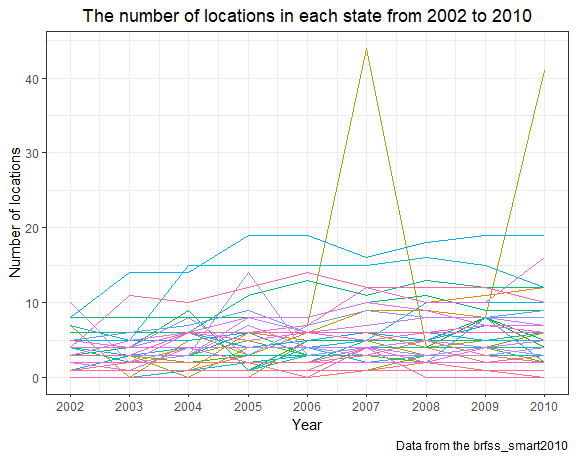
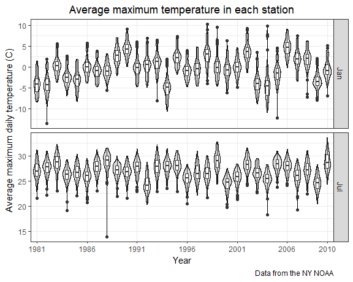

p8105\_hw3\_hq2163\_hanbo
================
Hanbo Qiu
October 7, 2018

Problem 1
---------

**Create an `overall_health` dataset and clean it:**

``` r
data(brfss_smart2010)

overall_health = janitor::clean_names(brfss_smart2010) %>% 
  select(year, location_abbr = locationabbr, location_desc = locationdesc, everything()) %>%
  filter(topic == "Overall Health") %>% 
  mutate(response = factor(response, levels = c("Excellent", "Very good", "Good", "Fair", "Poor"), ordered = TRUE))
```

We first load the data. Then we format the variables to use appropriate names, focus on the “Overall Health” topic, and organize responses as a factor taking levels ordered from “Excellent” to “Poor”.

**Which states were observed at 7 locations in 2002?**

``` r
filter(overall_health, year == 2002) %>% 
  distinct(location_abbr, location_desc) %>% 
  count(location_abbr) %>% 
  filter(n == 7) %>% 
  knitr::kable(col.names = c("State", "No. of locations"))
```

| State |  No. of locations|
|:------|-----------------:|
| CT    |                 7|
| FL    |                 7|
| NC    |                 7|

The first column of the above table shows the states observed at 7 locations in 2002.

**Make a “spaghetti plot” that shows the number of locations in each state from 2002 to 2010:**

``` r
distinct(overall_health, year, location_abbr, location_desc) %>% 
  ggplot(aes(x = year, color = location_abbr)) +
  geom_freqpoly(binwidth = 1) +
  scale_x_continuous(breaks = 2002:2010, limits = c(2002,2010)) +
  labs(
    title = "The number of locations in each state from 2002 to 2010",
    x = "Year",
    y = "Number of locations",
    caption = "Data from the brfss_smart2010"
  ) +
  theme(legend.position = "none")
```

    ## Warning: Removed 102 rows containing missing values (geom_path).



The above plot is really like a bowl of twisted spaghetti. As the lines entangled together, it is hard for us to find sufficient information. All we can find in this plot are that the numbers of locations in most states are less than 10, and there is a state (shown in yellow line) has over 40 locations observed in 2007 and 2010.

**Showing the mean and standard deviation of the proportion of “Excellent” responses across locations in NY State in 2002, 2006, and 2010:**

``` r
overall_health %>% 
  filter(year %in% c(2002, 2006, 2010), 
         response == "Excellent", 
         location_abbr == "NY") %>% 
  group_by(year) %>% 
  summarise(mean = mean(data_value, na.rm = TRUE),
            sd = sd(data_value, na.rm = TRUE)) %>% 
  knitr::kable(col.names = c("Year", "Mean of excellent proportion(%)", "SD of excellent proportion(%)"),
               digits = 2)
```

|  Year|  Mean of excellent proportion(%)|  SD of excellent proportion(%)|
|-----:|--------------------------------:|------------------------------:|
|  2002|                            24.04|                           4.49|
|  2006|                            22.53|                           4.00|
|  2010|                            22.70|                           3.57|

The above table shows the mean and standard deviation of the proportion of "Excellent" responses across locations in NY State in 2002, 2006, and 2010. All the values are rounded off to 2 decimal places.

**For each year and state, compute the average proportion and make a five-panel plot:**

``` r
select(overall_health, year, location_abbr, response, data_value) %>% 
  group_by(response, year, location_abbr) %>% 
  summarise(mean = mean(data_value, na.rm = TRUE)) %>% 
  ungroup %>% 
  mutate(year = as.factor(year)) %>% 
  ggplot(aes(x = year, y = mean)) +
  geom_boxplot(width = 0.3) +
  facet_grid(response ~., scales = "free_y") +
  labs(
    title = "Distribution of state-level average proportions
   in each response category from 2002-2010",
    x = "Year",
    y = "The average proportion of response",
    caption = "Data from the brfss_smart2010"
  )
```


We use a 5-panels box plot to show the distribution of average proportion in each response category for each year and state. From the plot, we can see the state-level average proportions did not changed significantly, although there exists some outliers.

Problem 2
---------

**Load the data from the `p8105.datasets` package:**

``` r
data(instacart)
```

**Write a short description of the dataset:**

Instacart is an online grocery service that allows you to shop online from local stores. The dataset contains 1384617 observations and 15 variables of 131209 users. Each row in the dataset shows the information of a specific product in one order. Some key variables are `user_id` and `order_id`, by which we can identify each user and order. `product_id`/`product_name`, `aisle_id`/`aisle`, `department_id`/`department` are key variables for product. The most important variables are `reordered`, `order_number`, `order_dow`, `order_hour_of_day`, `days_since_prior_order`, they can help us understand the customers' purchasing and consumption behaviour.

**How many aisles are there, and which aisles are the most items ordered from?**

There are 134 aisles.

``` r
item_aisle = instacart %>% 
  group_by(aisle_id, aisle) %>% 
  summarise(n= n()) %>% 
  arrange(desc(n)) %>% 
  head(5) 
knitr::kable(item_aisle, col.names = c("Aisle ID", "Aisle Name", "n"))
```

|  Aisle ID| Aisle Name                 |       n|
|---------:|:---------------------------|-------:|
|        83| fresh vegetables           |  150609|
|        24| fresh fruits               |  150473|
|       123| packaged vegetables fruits |   78493|
|       120| yogurt                     |   55240|
|        21| packaged cheese            |   41699|

From the above table, we can see No. 83 fresh vegetables aisle is the most items ordered aisle.

**Make a plot that shows the number of items ordered in each aisle:**

``` r
instacart %>% 
  mutate(aisle_id = as.factor(aisle_id)) %>% 
  group_by(department, aisle_id) %>% 
  summarise(n = n()/1000)  %>% 
  ggplot(aes(x = aisle_id, y = n)) +
  geom_col() +
  facet_wrap("department", ncol = 5, scales = "free_x") +
  scale_y_log10() +
  theme(axis.text.x=element_blank()) +
  labs(
    title = "The no. of items ordered in each aisle grouped by department",
    x = "Aisle",
    y = "Number of items (×1,000)",
    caption = "Data from the Instacart"
  )
```


The above plot shows the number of items ordered in each aisle. As there are 134 aisles, it is really hard to show all of them in one plot. So we use `facet_wrap` function to organize aisles by departments. We recruit a log scale on y axis because the numbers span several orders of magnitude.

**Make a table showing the most popular item in each of the aisles `baking ingredients`, `dog food care`, and `packaged vegetables fruits`:**

``` r
filter(instacart, aisle %in% c("baking ingredients", "dog food care", "packaged vegetables fruits")) %>%
  group_by(aisle, product_name) %>% 
  summarise(n = n()) %>% 
  filter(min_rank(desc(n)) == 1) %>% 
  select(aisle, product_name) %>% 
  arrange(aisle) %>% 
  knitr::kable(col.names = c("Aisle", "Most popular product"))
```

| Aisle                      | Most popular product                          |
|:---------------------------|:----------------------------------------------|
| baking ingredients         | Light Brown Sugar                             |
| dog food care              | Snack Sticks Chicken & Rice Recipe Dog Treats |
| packaged vegetables fruits | Organic Baby Spinach                          |

The above table shows the most popular product in `baking ingredients`, `dog food care`, and `packaged vegetables fruits` aisles.

**Make a table showing the mean hour of the day at which `Pink Lady Apples` and `Coffee Ice Cream` are ordered on each day of the week:**

``` r
filter(instacart, product_name %in% c("Pink Lady Apples", "Coffee Ice Cream")) %>% 
  group_by(product_name, order_dow) %>% 
  summarise(mean = round(mean(order_hour_of_day), 0)) %>% 
  mutate(mean = as.character(mean),
         mean = paste(mean, ":00", sep = "")) %>% 
  spread(key = order_dow, value = mean ) %>% 
  knitr::kable(col.names = c("Product", "Sun", "Mon", "Tue", "Wed", "Thu", "Fri", "Sat"))
```

| Product          | Sun   | Mon   | Tue   | Wed   | Thu   | Fri   | Sat   |
|:-----------------|:------|:------|:------|:------|:------|:------|:------|
| Coffee Ice Cream | 14:00 | 14:00 | 15:00 | 15:00 | 15:00 | 12:00 | 14:00 |
| Pink Lady Apples | 13:00 | 11:00 | 12:00 | 14:00 | 12:00 | 13:00 | 12:00 |

The above table shows the mean hour of the day at which `Pink Lady Apples` and `Coffee Ice Cream` are ordered on each day of the week. As the data does not specify the meaning of values in order\_dow variable, we assume that the values of 0~6 represent Sunday to Saturday.

Problem 3
---------

**Load the data from the `p8105.datasets` package:**

``` r
data(ny_noaa)
```

**Write a short description of the dataset:**

The ny\_noaa data provides weather records in NY state during 1981-2010. It contains 2595176 observations and 7 variables, where each row records the weather records of a certain day observed in a certain sation. The key variables include `prcp`, `snow`, `snwd`, `tmax`, and `tmin`, which represent precipitation, snowfall, snow depth, maximum temperature, and minimun temperature, respectively. `prcp`, `snow` and `snwd` are all `Integer` class variables, while `tmax` and `tmin` are `Character` variables.

The proportion of missing values in some variables are 0.056 for `prcp`, 0.15 for `snow`, 0.23 for `snwd`, 0.44 for `tmax`, and 0.44 for `tmin`. Other than `prcp`, the proportions of missing values in other four variables are all over 10%. For `tmax` and `tmin`, the proportion are over 40%. So we think the dataset contains such extensive missing data would influence the analysis significantly.

**Do some data cleaning:**

``` r
ny_noaa_ymd = separate(ny_noaa, date, into = c("year", "month", "day"), sep = "-") %>% 
    mutate(prcp = prcp / 10, tmin = as.numeric(tmin) / 10, tmax = as.numeric(tmax) / 10)
```

We separate `date` to three variables (`year`, `month`, `day`), and convert observations for `prcp`, `tmax` and `tmin` to reasonable units.

**For snowfall, what are the most commonly observed values? Why?**

``` r
snowfall_daycount = count(ny_noaa, snow, sort = T) %>% 
  head(5)
knitr::kable(snowfall_daycount, col.names = c("Snowfall (mm)", "No. of observations"))
```

|  Snowfall (mm)|  No. of observations|
|--------------:|--------------------:|
|              0|              2008508|
|             NA|               381221|
|             25|                31022|
|             13|                23095|
|             51|                18274|

From the above table, we find the most observed values for snowfall is 0 mm. We thought is is because there is no snowfall in most days in NY.

**Make a two-panel plot showing the average max temperature in January and in July in each station across years:**

``` r
filter(ny_noaa_ymd, month %in% c("01","07")) %>%
  mutate(month = recode(month, "01" = "Jan", "07" = "Jul")) %>% 
  group_by(id, year, month) %>% 
  summarise(mean_tmax = mean(tmax, na.rm = T)) %>%
  ggplot(aes(x = year, y = mean_tmax)) +
  geom_violin(color = "black", fill = "grey", alpha = 0.5) +
  geom_boxplot(width = 0.3) +
  scale_x_discrete(breaks = c("1981", "1986", "1991", "1996", "2001", "2006", "2010")) +
  facet_grid(month ~., scales = "free_y") +
  labs(
    title = "Average maximum temperature in each station",
    x = "Year",
    y = "Average maximum daily temperature (C)",
    caption = "Data from the NY NOAA"
  )
```

    ## Warning: Removed 5970 rows containing non-finite values (stat_ydensity).

    ## Warning: Removed 5970 rows containing non-finite values (stat_boxplot).



We use a two-panel violin plot to shows the average maximum temperature in January and in July in each station across years. The violin layer shows the probability distribution of the average maximum temperature in each station, and the box layer indicates the medians, quartiles, and outliers in the plot. From the plot, we can see that all the distributions follow the normal distribution. The mean values of average maximum temperature in each station fluctuated from -5 ℃ to 5 ℃ in Januray, and 24 ℃ to 29 ℃ in July. There exist plenty of outliers in the plot. For example, the average maximum temperature of one station in July 1987 was below 15 ℃，while the median was near 30 ℃.

**Make a two-panel plot (i) `tmax` vs `tmin` for the full dataset; and (ii) make a plot showing the distribution of snowfall values greater than 0 and less than 100 separately by year:**

``` r
tmax_tmin = ggplot(ny_noaa_ymd, aes(x = tmin, y = tmax)) + 
  geom_bin2d(bins = 40) +
  labs(
    title = "Maximum temperature vs minimum temperature",
    x = "Minimum temperature (C)",
    y = "Maximum temperature (C)"
  ) +
  coord_fixed()

snow_fall = filter(ny_noaa_ymd, snow > 0, snow <100) %>% 
  ggplot(aes(x = year, y = snow)) +
  geom_violin(color = "black", fill = "grey") +
  geom_boxplot(width = 0.2) +
  scale_x_discrete(breaks = c("1981", "1986", "1991", "1996", "2001", "2006", "2010")) +
  labs(
    title = "The distribution of snowfall in each year",
    x = "Year",
    y = "Snow fall (mm)",
    caption = "Data from the NY NOAA"
  )  

tmax_tmin + snow_fall + plot_layout(ncol = 1, heights = c(3, 1))
```

    ## Warning: Removed 1136276 rows containing non-finite values (stat_bin2d).


The upper plot shows the maximum temperature VS minimum temperature for the full dataset. As there are 1458900 records in all, we use `geom_bin2d` function to make a heatmap instead of a traditional scatterplot.

The lower violin plot shows the distribution of snowfall in each year. The violin layer shows the most values of observations are under 30 or around 50. The box layer indicates that the median values of each years are about 25.
